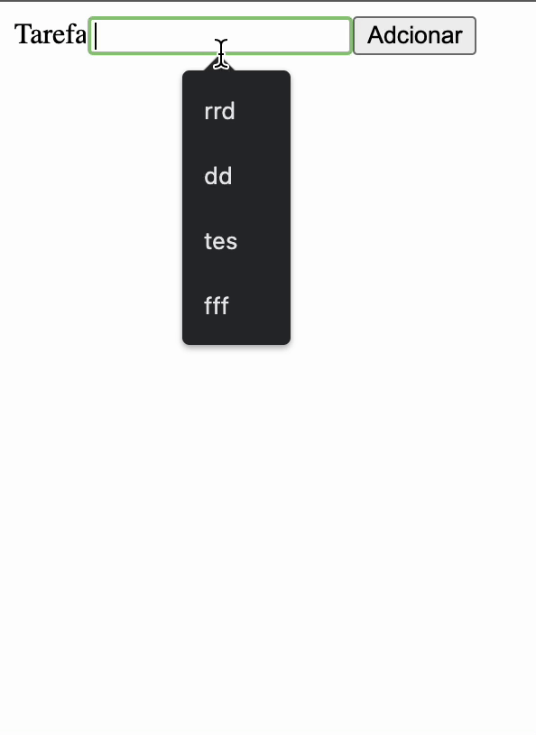

# Instruções de Desenvolvimento - Aplicação de Todo List

## Descrição da Aplicação

Este repositório contém um template para uma aplicação de Todo List, desenvolvida em React, que deve permitir cadastrar, listar e concluir tarefas.

A aplicação está dividida em quatro componentes:

- **Form**: responsável por gerenciar o formulário de cadastro de tarefas;
- **Input**: responsável por gerenciar os inputs do formulário;
- **List**: gerencia uma lista de todos os itens cadastrados;
- **ListItem**: gerencia cada item individual da lista de tarefas.

## Como Rodar a Aplicação

Para rodar a aplicação, siga os seguintes passos:

1. Clone o repositório em sua máquina: `git clone https://github.com/Kenzie-Academy-Brasil-Developers/dojo-m3-template`
2. Acesse o diretório do projeto: `cd dojo-m3-template`
3. Instale as dependências do projeto com o comando: `npm install`
4. Rode o comando: `npm run dev` para iniciar a aplicação

## Tarefas a Serem Desenvolvidas

Para o desenvolvimento da aplicação, você deve implementar as seguintes tarefas:

1. Permitir o cadastro de uma nova tarefa na lista de Todo;
2. Permitir a listagem de todas as tarefas cadastradas na lista;
3. Permitir a conclusão de uma tarefa cadastrada na lista.

Você pode fazer alterações nos componentes conforme a necessidade, incluindo a criação de estados, passagem de props e criação de funções adicionais para atender aos requisitos.

No final, esperamos que a aplicação tenha o seguinte resultado:

